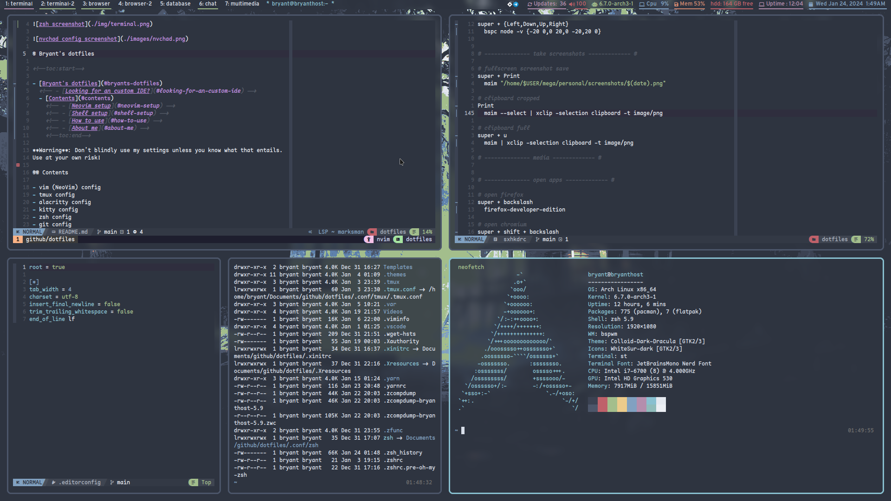

# Bryant's dotfiles

<!--toc:start-->

- [Bryant's dotfiles](#bryants-dotfiles)
  <!-- - [Looking for an custom IDE?](#looking-for-an-custom-ide) -->
  - [Contents](#contents)
    <!-- - [Neovim setup](#neovim-setup) -->
    <!-- - [Shell setup](#shell-setup) -->
    <!-- - [How to use](#how-to-use) -->
    <!-- - [About me](#about-me) -->
    <!--toc:end-->

**Warning**: Don’t blindly use my settings unless you know what that entails.
Use at your own risk!

## Contents

- neovim (NeoVim) config
- tmux config
- alacritty config
- kitty config
- zsh config
- git config
- list of software
- other configs

## About me

- [Twitter](https://twitter.com/plbryantt)
