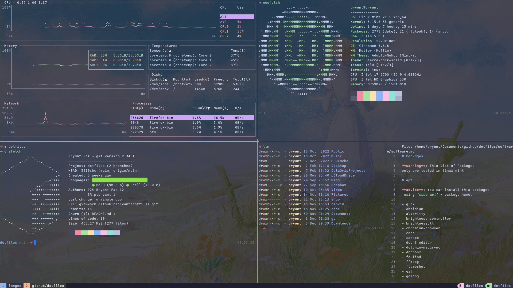
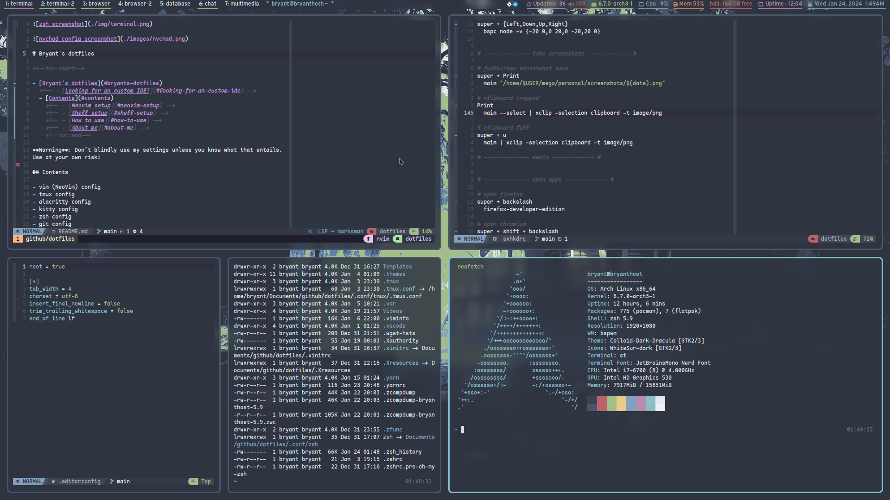

# dotfiles





Personal configuration files for my development environment — feel free to use, fork, or take inspiration from anything here.

## Structure

```
.
├── .config/
│   ├── yazi/               # File manager config with Catppuccin Mocha flavor
│   │   ├── flavors/
│   │   └── plugins/
│   ├── mpv/                # Media player config with Anime4K upscaling shaders
│   │   └── shaders/
│   ├── bat/                # Better `cat` with all four Catppuccin themes
│   │   └── themes/
│   ├── fish/               # Fish shell config with autopair plugin
│   │   └── plugins/
│   └── mpd/                # Music Player Daemon config
├── bin/
│   └── global/             # Personal scripts available globally in PATH
├── img/                    # Screenshots and preview images
│   ├── terminal.png
│   └── nvchad.png
└── README.md
```

## What's inside

| Tool           | Description                                                                        |
| -------------- | ---------------------------------------------------------------------------------- |
| **yazi**       | Terminal file manager — configured with the Catppuccin Mocha color scheme          |
| **mpv**        | Video player — includes Anime4K CNN shaders for upscaling and restoration          |
| **bat**        | `cat` replacement — all four Catppuccin variants (Latte, Frappe, Macchiato, Mocha) |
| **fish**       | Shell — includes the `autopair.fish` plugin for bracket/quote autopairing          |
| **mpd**        | Music Player Daemon — base configuration                                           |
| **bin/global** | Custom scripts added to `$PATH` for daily use                                      |

## Try my full setup

Want to spin up my exact environment without touching your own machine?

Head over to **[pazbryant7/ansible-dots](https://github.com/pazbryant7/ansible-dots)** — there's a Docker image so you can try the whole setup for yourself with a single command.

## Usage

These dotfiles are public and free to use. Copy whatever is useful, adapt it to your own workflow, or use it as a reference. No attribution required.

If something is broken or unclear, feel free to open an issue.
